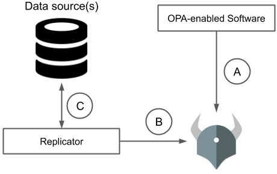

# Intro

An API Server serving RBAC authorization using OPA where rule data are stored in DB.
<br><br>

### External Data: [Option 5: Pull Data during Evaluation](https://www.openpolicyagent.org/docs/latest/external-data/#option-5-pull-data-during-evaluation)
<br>



<br>

### Tech stacks used
- language
  - go, rego
- db:
  - mariadb
- framework
  - gin-gonic framework
  - go wire
- orm
  - gorm
- rule engine
  - [OPA](https://www.openpolicyagent.org/docs/latest/integration/#integrating-with-the-go-api)

<br>

### Check List
[ o ] implement opa logic using opa lib <br>
[ o ] service web using gin <br>
[ o ] use DI framework - used go wire <br>
[ o ] api for evaluating rbac <br>
[ x ] Select SQL for data json used by opa engine from DB <br>
[ x ] api for CRUD permission, role, user, project <br>
[ x ] api for CRUD permission to role, role to user <br>

<br>

# Rego
```rego
package rbac

default allow = false

allow {
    # Look up the list of projects the user has access too.
    project_roles := data.roles[input.user_id]

    # For each of the roles held by the user for the named project.
    project_role := project_roles[input.project]
    pr := project_role[_]

    # Lookup the permissions for the roles.
    permissions := data.permissions[pr]

    # For each role permission, check if there is a match.
    p := permissions[_]
    p == concat("", [input.action, ":", input.resource])
}
```
<br>
<br>

# Data.json
```json
{
  "roles": {
    "id:customer_1:project:project_1:user:user_1": {
      "id:customer_1:project:project_1": [
        "administrator"
      ]
    },
    "id:customer_1:project:project_2:user:user_2": {
      "id:customer_1:project:project_2": [
        "administrator"
      ]
    },
    "id:customer_1:project:project_1:user:user_3": {
      "id:customer_1:project:project_1": [
        "viewer"
      ]
    },
    "id:customer_1:project:project_2:user:user_4": {
      "id:customer_1:project:project_2": [
        "manager"
      ]
    }
  },
  "permissions": {
    "administrator": [
      "view:resource",
      "update:resource",
      "create:resource",
      "delete:resource"
    ],
    "viewer": [
      "view:resource"
    ],
    "manager": [
      "view:resource",
      "update:resource"
    ]
  }
}
```

<br>
<br>


# Test

## 1. user_1 who is in project_1 wants to create resource

**Request**
```shell
curl -X POST --location "http://localhost:9999/api/v1/eval" \
    -H "Content-Type: application/json" \
    -d "{
          \"user_id\": \"id:customer_1:project:project_1:user:user_1\",
          \"project\": \"id:customer_1:project:project_1\",
          \"action\": \"create\",
          \"resource\": \"resource\"
        }"
```
<br>

**Response**
```shell
{
  "code": 1,
  "message": "Success",
  "data": true
}
```
RESULT: _Allowed!_

<br>
<br>


## 2. user_4 who is in project_2 wants to delete resource

**Request**
```shell
curl -X POST --location "http://localhost:9999/api/v1/eval" \
    -H "Content-Type: application/json" \
    -d "{
          \"user_id\": \"id:customer_1:project:project_2:user:user_4\",
          \"project\": \"id:customer_1:project:project_2\",
          \"action\": \"delete\",
          \"resource\": \"resource\"
        }"
```

<br>

**Response**
```shell
{
  "code": 1,
  "message": "Success",
  "data": false
}
```

RESULT: _Denied! No permission to delete resource!_
